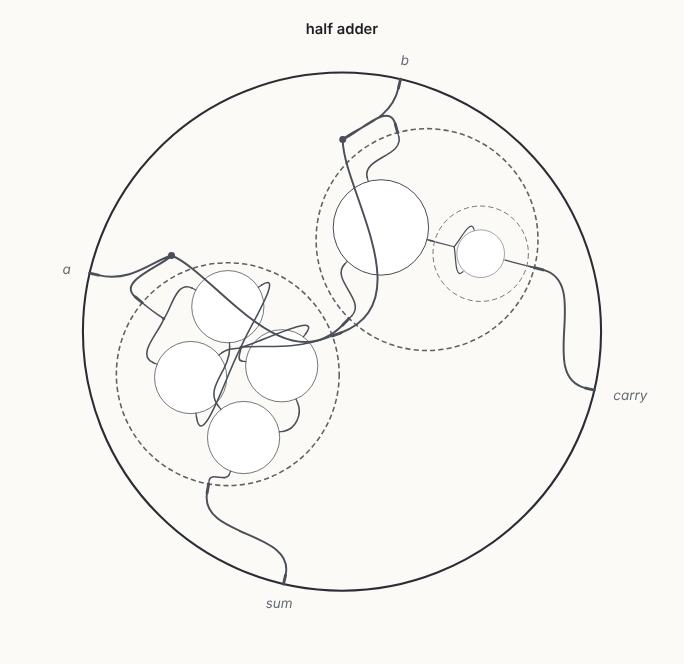
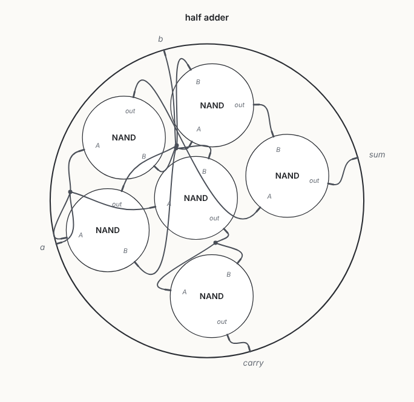

# d3-wiring-diagrams

The operad of wiring diagrams from Spivak,
[*The operad of wiring diagrams*](https://arxiv.org/abs/1305.0297), implemented
in Python, Rust and JavaScript, with a d3 viewer.

| Nested: each sub-term drawn inside the star it fills | Composed: the same term after composition |
| --- | --- |
|  |  |

*"A wiring diagram of wiring diagrams is a wiring diagram."* The left picture
is a three-level term. XOR and AND are built from NAND gates and wired into a
half adder. The right picture is its composite. Both have the same relation,
which the viewer computes live from the NAND truth table.

## What is implemented

The paper's operad and everything it constructs on it:

- **Objects**: typed stars, i.e. finite sets of wires, each with a type.
- **Morphisms**: typed cospans `X₁ ⊔ … ⊔ Xₙ → C ← Y`, kept in a canonical form
  so that equality is equality *up to renaming cables*.
- **Composition** by pushout, full (`compose`) and partial (`compose_at`).
  Also identities, the **symmetric group action** (`permute`), and the
  functors between the typed and singly-typed operads (`map_types`).
- **Closed structure**: `[Y ⇒ Z]`, evaluation, and externalization /
  internalization.
- **Algebras**: Rel (relations; conjunctive queries), including unions
  (disjunctive queries) and **recursion** as a greatest fixed point; and Eq
  (equivalence relations).
- **Code as wiring diagrams**: `wiring_diagrams.code` scans Python source.
  - A function is a star with wires for its parameters and `return`, filled
    with the dataflow of its body.
  - Calls into the same module have the callee's own star, so **inlining is
    operadic composition**.
  - Every star records the code it came from, so the viewer links stars and
    source both ways.
  - [`examples/python/`](examples/python/) holds eleven small programs, each
    tested by its doctests and scanned into `spec/examples/`.
  - In the playground the same scanner runs in the browser, behind a code
    editor (CodeMirror), and the diagram follows your edits.
- **Laws** checked by property tests in every language: identity,
  associativity, equivariance, functoriality of each algebra, and the
  closed-structure bijection.

[docs/theory.md](docs/theory.md) maps each definition in the paper to the code.

## Layout

```
python/   pure-Python reference implementation (no dependencies)
rust/     Rust crate (serde behind the default feature)
js/       ES modules: the same core + layout.js, scene.js, render.js (d3)
viewer/   the viewer and playground (plain HTML/CSS/JS, vendored d3 and CodeMirror)
site/     builds README + docs + viewer into dist/ (deployed by vercel.json)
spec/     JSON Schema, the examples, and the shared conformance suite
examples/ python/: programs scanned into spec/examples/code-*.json
scripts/  generate.py: writes spec/ from the Python reference
docs/     theory, format, code, visualisation, performance, journal
```

The three implementations share one JSON format ([docs/format.md](docs/format.md))
and one error vocabulary. All three must reproduce every case of
`spec/conformance/` (868 cases: composition, canonical form, permutation,
closed structure, Rel, Eq, and error kinds) and every example in
`spec/examples/`.

## Use

**Python** (3.10+)

```python
from wiring_diagrams import Star, WiringDiagram, rel

# NOT from NAND (Spivak, Ex. 2.2.11): solder both NAND inputs onto one cable
phi = WiringDiagram(["Bool", "Bool"], [{"A": 0, "B": 0, "out": 1}], {"in": 0, "out": 1})
nand = rel.Relation.from_predicate(
    phi.inner[0], {"Bool": [False, True]}, lambda r: r["out"] == (not (r["A"] and r["B"]))
)
rel.apply(phi, [nand]).records()  # [{'in': False, 'out': True}, {'in': True, 'out': False}]
phi.compose([WiringDiagram.identity(phi.inner[0])]) == phi  # True
```

Scanning code (see [docs/code.md](docs/code.md)):

```sh
python -m wiring_diagrams.code module.py -f hypot --expand 1 > hypot.json   # open in the viewer
```

```python
from wiring_diagrams.code import scan_source

term = scan_source(source, function="hypot", expand=1)  # calls into the module filled in
term.evaluate()                                        # the inlined, composite diagram
```

**Rust**

```rust
use wiring_diagrams::{Star, WiringDiagram};

let not = WiringDiagram::new(["Bool", "Bool"], [[("A", 0), ("B", 0), ("out", 1)]], [("in", 0), ("out", 1)])?;
assert_eq!(not.compose(&[WiringDiagram::identity(&not.inner()[0])])?, not);
```

**JavaScript**

```js
import { WiringDiagram, rel } from "./js/src/index.js";
import { createRenderer } from "./js/src/render.js";

const phi = new WiringDiagram(["Bool", "Bool"], [{ A: 0, B: 0, out: 1 }], { in: 0, out: 1 });
createRenderer(d3, document.querySelector("svg")).draw(phi);
```

**Viewer and playground** ([`viewer/`](viewer/)):
- Switch between the nested and composed views.
- Hover a cable to see everything composition glues to it.
- Click a star to see its relation.

The **Playground** button opens an editor beside the diagram. Its **Python**
tab draws the code you write: pick one of the example programs or start your
own, choose the function to draw and how many levels of calls to inline, and
the diagram follows your edits. Hover a star to see its code; put the cursor in
the code to see its stars. The **JSON** tab accepts any example, term or
diagram, including `term.to_json()` from Python or
`serde_json::to_string(&term)` from Rust. You can also:
- plug sub-diagrams from the examples into a star (Spivak's plug-and-play,
  §5.1), with the relations kept consistent;
- collapse a sub-diagram back into one star;
- compose the whole term;
- share the result as a link.

**Site**: `just site` builds the docs pages, the viewer and the playground into
`dist/`. `vercel.json` deploys that directory, and every push gets a preview.
To run it locally, `just serve` and open <http://localhost:8000/viewer/>.

## Develop

`just` runs the same lint and test steps as CI: ruff, mypy `--strict` and
pytest; rustfmt, clippy (pedantic, `-D warnings`) and cargo test with and
without serde; `tsc --checkJs --strict` and `node --test`. After changing
Python behaviour or a program in `examples/python/`, run `just generate` to
rewrite `spec/`. The Python tests fail while it is stale. After changing
CodeMirror's version or what the viewer imports from it
(`site/codemirror.entry.js`), run `just vendor`; CI fails while the bundle is
stale.

Performance figures are in [docs/performance.md](docs/performance.md), and the
layout algorithm is in [docs/visualisation.md](docs/visualisation.md). Work is
logged in [docs/journal/](docs/journal/), in the format of
[docs/JOURNAL.md](docs/JOURNAL.md).
